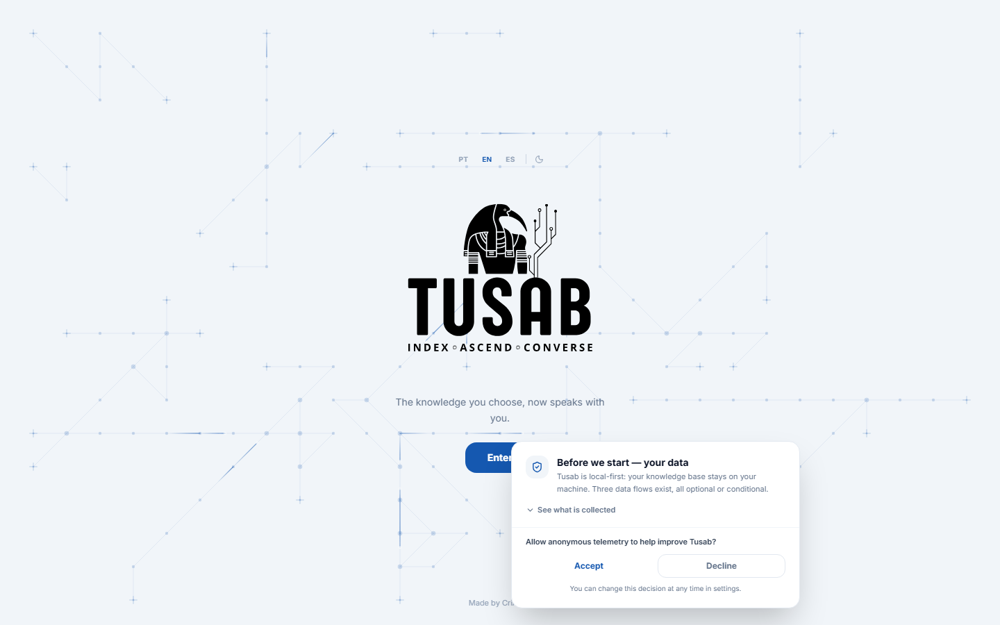
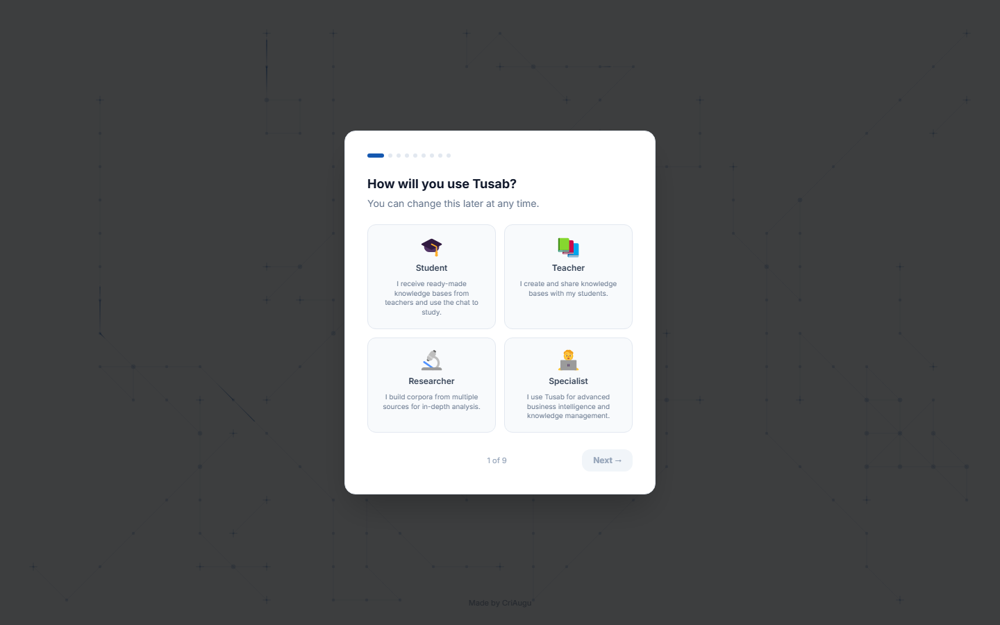
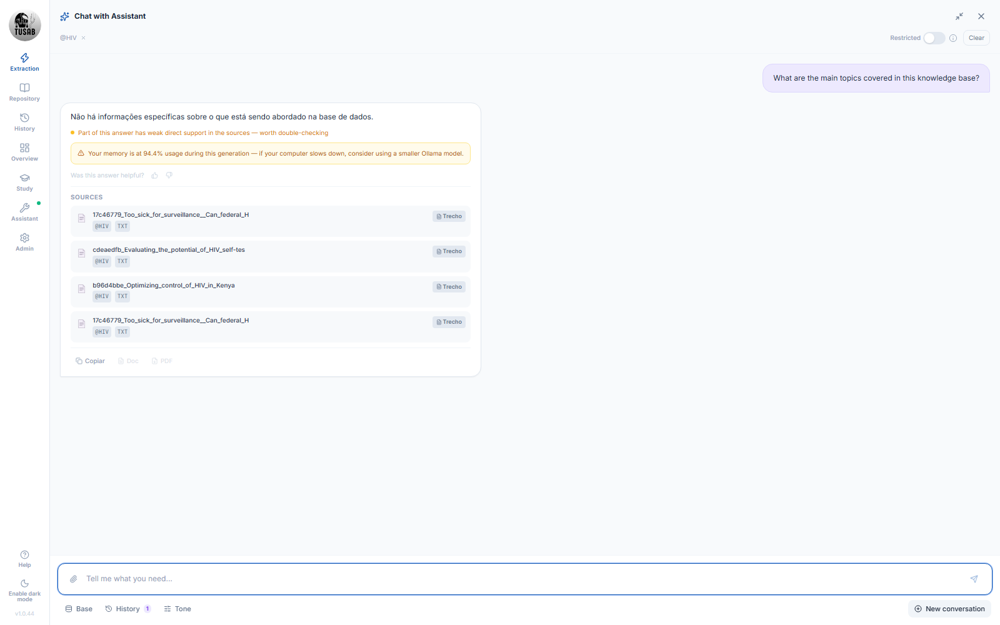
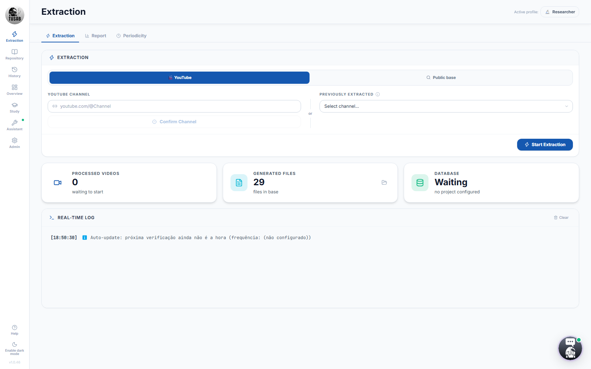
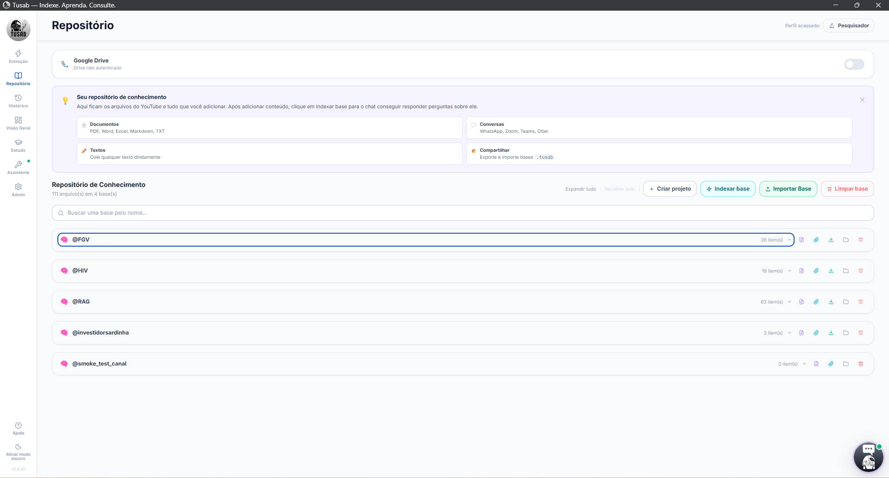
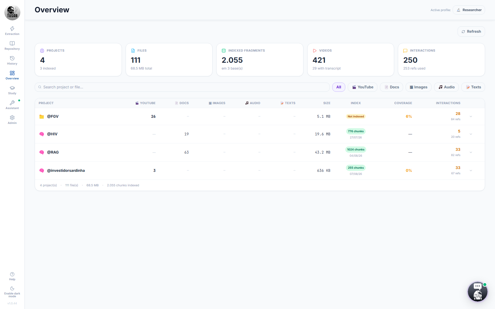
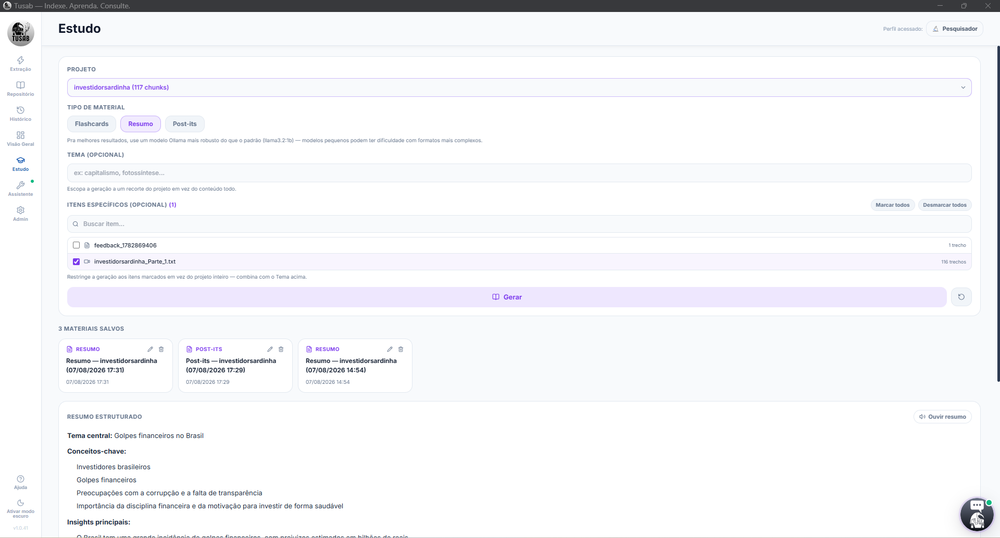
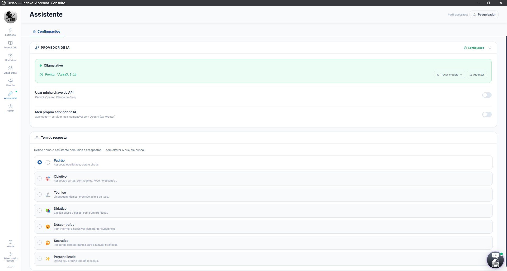

```text
████████╗██╗   ██╗███████╗ █████╗ ██████╗
╚══██╔══╝██║   ██║██╔════╝██╔══██╗██╔══██╗
   ██║   ██║   ██║███████╗███████║██████╔╝
   ██║   ██║   ██║╚════██║██╔══██║██╔══██╗
   ██║   ╚██████╔╝███████║██║  ██║██████╔╝
   ╚═╝    ╚═════╝ ╚══════╝╚═╝  ╚═╝╚═════╝
            INDEX-AUGMENT-CHAT
```

# Tusab

**INDEX · AUGMENT · CHAT**

Your personal specialist. Point it at what you want to learn — a YouTube channel, a PDF, a document — and Tusab absorbs it all and answers your questions citing the exact source. Runs on your machine, works offline, zero cost with Ollama.

Built by **Augusto Brasil** · [CriAugu](https://linkedin.com/in/augustoalvesbrasil) — CNPJ 65.131.075/0001-57

---

## Download

**[⬇ Download latest release](https://github.com/ahaugusto/tusab/releases/latest)**

| Platform | Requirement | File |
|---|---|---|
| Windows 10/11 x64 | — | `Tusab-Setup-X.X.X.exe` |
| macOS (Apple Silicon — M1 or newer) | macOS 14 (Sonoma)+ | `Tusab-X.X.X-arm64.dmg` |

Python and yt-dlp are bundled in both installers — nothing else to install.
**macOS Intel is not supported at the moment** (Apple Silicon/arm64 only).

### Installing on macOS

1. Download the `.dmg` (link above).
2. Open the `.dmg` and drag the Tusab icon into **Applications**.
3. Launch Tusab from Applications. The app is **signed and notarized by Apple**
   (Developer ID + automated notarization in CI) — it opens normally, no need
   to manually allow anything in System Settings → Privacy & Security.
4. On first launch, Tusab detects whether Ollama is installed and offers to
   download it automatically if not.

---

## What it is

Tusab is a personal knowledge management (PKM) system with local AI. You decide what
the specialist learns — videos, documents, notes — and query it via natural-language
chat. It only answers with what you've indexed, always citing the exact source the
excerpt was retrieved from.

| Letter | Stage | What it does |
|--------|-------|---------------|
| **I** | Index | Extraction and indexing of YouTube, PDFs, DOCX, Markdown, plain text |
| **A** | Augment | RAG with BM25 + CrossEncoder delivers precise chunks to the model |
| **C** | Chat | Chat with streaming, source citation and conversation history |

---

## Screenshots

<table>
<tr>
<td width="50%">

**Home — local-first, transparent about data from screen one**

</td>
<td width="50%">

**Pick a profile — change it anytime**

</td>
</tr>
<tr>
<td width="50%">

**Real answer, real sources — with a confidence flag when support is weak**

</td>
<td width="50%">

**Extraction — YouTube channels or public academic sources**

</td>
</tr>
<tr>
<td width="50%">

**Repository — every base you've built, in one place**

</td>
<td width="50%">

**Overview — coverage and index health at a glance**

</td>
</tr>
<tr>
<td width="50%">

**Study Mode — flashcards, summaries and post-its from your own base**

</td>
<td width="50%">

**Assistant — provider, custom endpoint, response tone**

</td>
</tr>
</table>

---

## Features

- Automatic extraction of entire YouTube channels (captions + metadata), with optional
  playlist selection and publish-date filtering
- Academic search on arXiv by topic (Researcher profile) — downloads and indexes the PDFs automatically
- Clinical study search via FHIR/ResearchStudy (Researcher profile) — public server, no auth, scoped to research studies
- Upload PDFs, DOCX, Markdown, CSV and TXT
- Upload images (PNG, JPG, WEBP, etc.) — description via multimodal Ollama or OCR (RapidOCR)
- Upload audio (MP3, WAV, M4A, etc.) — transcription via local faster-whisper
- Automatic parser for WhatsApp conversations and meeting transcripts (Zoom, Teams, Otter)
- Paste text directly from the interface
- Local RAG assistant: BM25Okapi + FTS5 (exact match) + CrossEncoder (ms-marco-MiniLM-L-6-v2) +
  anti-hallucination
- Narrow Search (pure BM25, ~1 ms) and Broad Search (BM25 + FTS5 + CrossEncoder, ~250 ms)
- Optional vector search (embeddings) via Ollama (`nomic-embed-text`, one-click download) — adds
  meaning-based retrieval on top of keyword search in Broad Search, fully local, degrades
  gracefully when the model isn't installed
- Streaming chat with verifiable source citation, adjustable response tone/persona,
  and 👍/👎 feedback that feeds useful answers back into the search index
- Multi-base: query multiple knowledge bases at once
- Ollama model picker plus external providers (Groq, OpenAI, Anthropic, Google) or any
  self-hosted OpenAI-compatible endpoint (e.g. [9router](https://github.com/decolua/9router))
- **Study Mode**: flashcards with spaced repetition (SM-2), structured summaries with
  local text-to-speech playback, and post-it style key points — all generated from your
  own indexed content and saved for later review
- **MCP Server**: expose your knowledge base to Claude Code, Cursor or any MCP-compatible
  editor, so you can query your own sources without leaving the tool you already use
- Optional backup to Google Drive (`drive.file` scope)
- Export a base as `.tusab` (portable between machines)
- Extraction report per channel with statistics and a video table
- Auto-update via GitHub Releases
- Internationalization: Portuguese, English, Spanish
- Opt-in telemetry (PostHog)

---

## AI Providers

| Provider | Default model | Cost | Requires API key |
|----------|--------------|------|-------------------|
| Ollama (default) | llama3.2:1b | Free | No |
| Groq | llama-3.1-8b-instant | Free tier | Yes |
| OpenAI | gpt-4o-mini | Paid | Yes |
| Anthropic | claude-haiku-4-5 | Paid | Yes |
| Google | gemini-1.5-flash | Paid | Yes |
| Custom endpoint | any OpenAI-compatible server | Depends on the server | Optional |

Ollama is configured on first run via a built-in wizard. For external providers, set the
key in **Configure Assistant** — it's tested before being saved and stored via DPAPI (Windows).

---

## Stack

**Backend:** Python 3.12 + FastAPI + Uvicorn — REST API on `localhost:8001`
**RAG assistant:** rank_bm25 (BM25Okapi) + SQLite FTS5 + sentence-transformers (CrossEncoder) + optional Ollama embeddings (`nomic-embed-text`) + Ollama / external providers
**Frontend:** React 19 + Vite + Tailwind CSS 3 + Framer Motion + Lucide React
**Desktop:** Electron 34 + electron-builder (NSIS installer for Windows · signed and notarized `.dmg`/`.zip` for macOS arm64)
**Extraction:** yt-dlp (bundled) + pdfplumber + python-docx
**Images:** multimodal Ollama (llava/gemma3) → RapidOCR fallback (bundled, no external install)
**Audio:** faster-whisper (`base` model, CPU, ~150 MB)
**Drive:** Google Auth OAuth2 (`drive.file` scope)

---

## Repository structure

```
Tusab/
  api_tusab.py              <- FastAPI entry point (~165 lines)
  motor_tusab.py            <- re-export shim (Electron compatibility)
  agent_tusab.py            <- re-export shim (Electron compatibility)
  tusab_engine/             <- main Python package
    storage.py                <- data paths + atomic IO
    state.py                  <- AppState singleton + LogRedirector
    agent/                    <- RAG assistant (internal module name kept as
                                  "agent" on purpose — see CLAUDE.md)
      config.py               <- load/save agent_config.json
      index.py                <- BM25 indexing + cache + CrossEncoder
      chat.py                 <- RAG chat + streaming
      fts.py                  <- SQLite FTS5 exact-match layer
      embeddings.py           <- optional vector search (Ollama nomic-embed-text)
      calibration.py          <- dynamic per-corpus retrieval tuning
      summarize.py            <- per-video LLM summaries ("deepen base")
      tts.py                  <- local text-to-speech (Study Mode audio)
    motor/
      drive.py                <- Google Drive OAuth + upload
      extraction.py           <- YouTube extraction engine
      auto_update.py          <- auto-update check
    api/
      router_status.py        <- GET /status, /drive-auth, /history, /open-folder
      router_extraction.py    <- POST /set-channel, /start, /pause, /cancel, /queue/*
      router_agent.py         <- /agent/* (chat, config, index, ollama, stream)
      router_estudo.py        <- /agent/study/* (flashcards, summary, post-its, TTS)
      router_repositorio.py   <- /repositorio, /relatorio, /neural/*, /reset-total
      router_exports.py       <- /export/* (zip, markdown, docx, xlsx, pdf)
      router_fontes.py        <- public academic sources (arXiv, FHIR, etc.)
      router_digest.py        <- scheduled digest
      router_metrics.py       <- GET /metrics
  requirements.txt            <- Python dependencies
  tests/                      <- test suite (229 tests)
  web_interface/              <- React frontend
    src/
      App.jsx                 <- main orchestrator
      components/             <- components by domain
      services/api.js         <- centralized API layer
      hooks/                  <- custom hooks (polling, chat, config)
      locales/                <- PT/EN/ES translations
    dist/                     <- frontend build (generated)
  electron/                   <- desktop wrapper
    main.js
    preload.js
    package.json
  CHANGELOG.md
```

---

## Data layout

In production (Electron): `%AppData%\Tusab\data\`
In development: `./data/`
Configurable via the `TUSAB_DATA_DIR` env var.

```
data/
  neural/
    {project}/
      youtube/        <- .txt transcripts extracted from YouTube
      documents/      <- PDFs, DOCX and other docs + _manifest.json
      texts/          <- pasted texts + _manifest.json
      estudo/         <- Study Mode artifacts (flashcards/summary/post-its + cached audio)
      management/     <- management CSVs, summary.json, README, report
  indexes/            <- BM25 indexes in JSON, one per project ({prefix}_index.json)
  config/             <- agent_config.json, credentials.json, token.json
  temp/               <- temporary VTTs (auto-removed)
```

**Security note:** the `config/` folder may contain API keys — don't include it in
unencrypted cloud backups. The `neural/` folder is safe to share.

---

## Development setup

**Prerequisites:** Node.js 20+, Python 3.12+, Git

```powershell
# Clone the repository
git clone https://github.com/ahaugusto/tusab.git
cd tusab

# Python virtualenv
python -m venv .venv
.venv\Scripts\Activate.ps1
pip install -r requirements.txt

# Frontend dependencies
cd web_interface
npm install
cd ..

# Electron dependencies
cd electron
npm install
cd ..
```

**Run in dev mode (two terminals):**

```powershell
# Terminal 1 — backend
.venv\Scripts\python.exe api_tusab.py

# Terminal 2 — frontend (hot reload)
cd web_interface
npm run dev
```

Interface available at `http://localhost:8001` (served by the backend from the generated `dist/`).
Hot reload at `http://localhost:5173` (Vite dev server).

**Environment variables:**

| Variable | Description |
|----------|--------------|
| `TUSAB_DATA_DIR` | Overrides the data directory (used in tests and packaged Electron) |
| `ELECTRON_RUN` | Set by Electron in production — suppresses automatic browser launch |
| `VITE_POSTHOG_KEY` | PostHog telemetry key (never commit — use `web_interface/.env`) |

---

## Production build

```powershell
# 1. Build the frontend
cd web_interface
npm run build
cd ..

# 2. Build the Windows installer
cd electron
npm run build
```

Output: `dist_electron/Tusab-Setup-X.X.X.exe`

**Prerequisite:** `electron/python_env/` must be populated with an embeddable Python 3.12
plus installed dependencies, and `electron/bin/yt-dlp.exe` must exist. These directories
are large and gitignored — set them up once locally before building.

---

## Tests

```powershell
# Integration suite (229 tests)
.venv\Scripts\python.exe -m pytest tests/ -v
```

229/229 green. The suite covers integration tests (FastAPI TestClient) and reliability
tests (atomic writes, concurrency, corrupted/empty index).

---

## Setting up Google Drive (optional)

1. In the [Google Cloud Console](https://console.cloud.google.com/), create a project and enable the **Google Drive API**
2. Create OAuth 2.0 credentials (Desktop app) and download the JSON
3. Rename it to `credentials.json` and place it at the project root
4. In the Tusab interface, enable Drive from the Repository tab — the OAuth flow opens in your browser
5. After authorizing, `token.json` is saved locally (both files are gitignored)

---

## Accessibility

WCAG 2.1 AA-compliant interface:

- Minimum 44×44px touch targets on all interactive buttons
- `aria-label` on every icon-only button
- `role="dialog" aria-modal="true"` on all modals via `ModalWrapper`
- Focus trap + `Escape` to close on modals
- `aria-live="polite"` on dynamic status (extraction, snackbars, streaming)
- `role="tooltip"` on sidebar tooltips
- `prefers-reduced-motion` respected globally
- Full keyboard navigation with shortcuts (`C` opens chat, `Shift+letter` switches tabs)

---

## Security

Tusab runs locally — no central server, no data in the cloud by default.

- CORS restricted to `localhost:8001`
- Path traversal blocked with `os.path.realpath()` on every file endpoint
- Prompt injection mitigated with XML delimiters in the RAG pipeline
- YouTube URLs validated against a regex whitelist before being passed to yt-dlp
- Chat history kept server-side (client-supplied payload is ignored)
- Electron with `contextIsolation: true`, `sandbox: true` and `nodeIntegration: false`
- yt-dlp executed via an argument list (never `shell=True`)
- API key masked (`***`) in the `GET /agent/config` response
- Keys stored via Electron's `safeStorage` (Windows DPAPI) when available
- Sensitive files gitignored: `credentials.json`, `token.json`, `.env`, `agent_config.json`

---

## Changelog

Full history of every release: [CHANGELOG.md](CHANGELOG.md).

---

## License

Copyright © 2026 CriAugu — CNPJ 65.131.075/0001-57

Source code available under the [Elastic License 2.0](LICENSE) — you may read,
audit, run and modify it freely for your own use. The one relevant restriction:
you may not offer Tusab as a hosted/managed service to third parties. The "Tusab"
name and brand are protected separately — see [TRADEMARK.md](TRADEMARK.md). We
are not accepting external Pull Requests at this time — see
[CONTRIBUTING.md](CONTRIBUTING.md). Third-party libraries used and their
licenses: [THIRD_PARTY_NOTICES.md](THIRD_PARTY_NOTICES.md).
